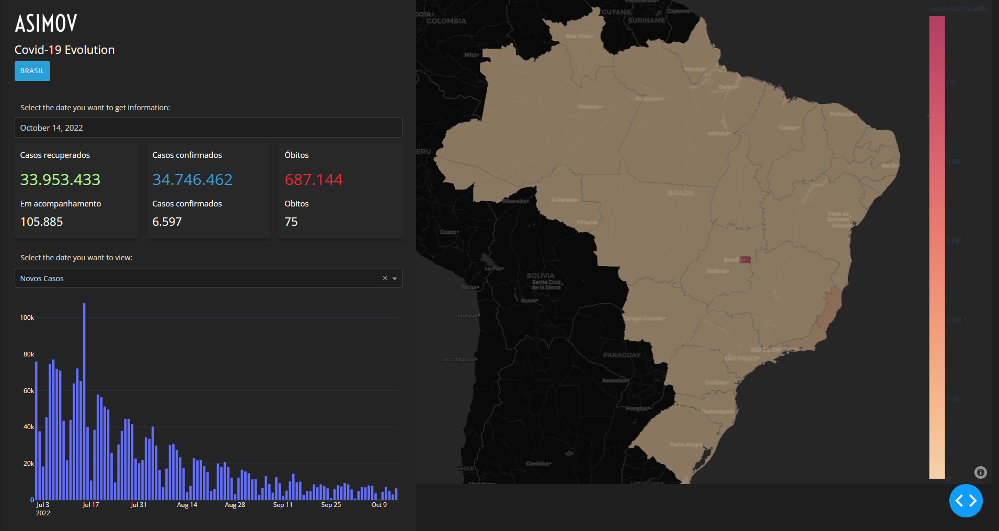

# Dashboard Covid-19

<!---Esses são exemplos. Veja https://shields.io para outras pessoas ou para personalizar este conjunto de escudos. Você pode querer incluir dependências, status do projeto e informações de licença aqui--->

> Dashboard developed to study Plotly Dash. The dashboard track the Covid-19 evolution on Brazil.

Thanks to [Asimov](https://asimov.academy/)

## 💻 Requires

Antes de começar, verifique se você atendeu aos seguintes requisitos:
<!---Estes são apenas requisitos de exemplo. Adicionar, duplicar ou remover conforme necessário--->
* `Python 3`
* `Pipenv`

## 🚀 Install

1. Clone this project to your computer
2. Run `pipenv install`

## ☕ Using

1. Run `pipenv run python src/app.py`
2. Open on browser the server address (default [http://127.0.0.1:8050])

## 🤝 Colaborators

<table>
  <tr>
    <td align="center">
      <a href="#">
         
        
          <b>Emanuel Almeida</b>
        
      </a>
    </td>
  </tr>
</table>

## 📝 Licence

This project is on license. See the [License](LICENSE.md) to more info.

[⬆ Back to the top](#dash-covid)
